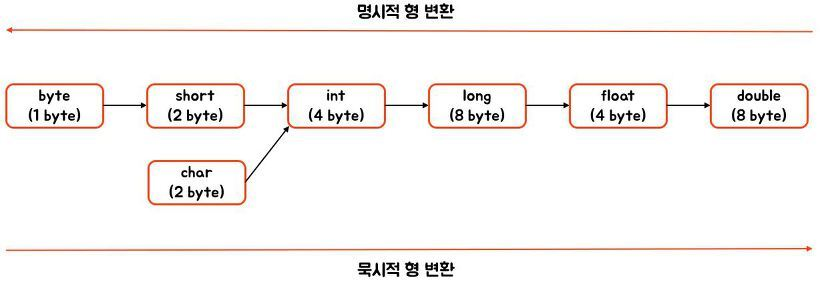

### 💭 5장 정리

---

#### ☑️ 삼항 연산자
```
변수 = boolean 조건식 ? true일때의 값 : false일때의 값;
```

#### ☑️ 형변환



---

### 💭 단답형

#### 1. 값을 할당할 때 사용하는 연산자의 기호는 무엇인가요?

- =

#### 2. 기본적인 덧셈, 뺄셈, 곱셈, 나눗셈, 나머지를 계산할 때 사용하는 연산자의 기호는 무엇인가요?

- +, -, *, /, %

#### 3. +=는 무엇을 할때 사용하는 연산자인가요?

- 왼쪽 변수에 오른쪽 값을 더한 후 할당하는 복합대입연산자

#### 4. 여러분들이 연산의 순서를 모르거나 확실히 하고 싶을때에는 어떤 기호를 사용해야 하나요?

- ( ) 소괄호

#### 5. ==와 !=의 차이는 무엇인가요?

- ==는 왼쪽 오른쪽 값이 같다, !=는 왼쪽 오른쪽 값이 다르다

#### 6. <와 <=의 차이는 무엇인가요?

- 같은 값 포함여부

#### 7. ! 연산자는 어떤 타입에 사용할 수 있나요?

- boolean

#### 8. ? : 로 표시하는 삼항연산자의 ?와 :뒤에 명시해 주는 값은 무엇을 의마하나요?

- 조건식이 참일 경우 ? 뒤에있는 값, 거짓일 경우 : 뒤에있는 값
```
조건식 ? true일때의 값 : false일떄의 값
```

#### 9. 자바는 형변환을 한다고 했는데, short의 값을 long에 할당할 때에는 어떤 것을 해주어야 하나요?

- 자동 형변환이 일어나므로 아무것도 안해도 됨

#### 10. 반대로 long값을 short에 할당 할 때에는 어떤 것을 해주어야 하나요?

- (short)

#### 11. 9와 10의 경우 어떤 경우가 기존 값이 사라지고, 엉뚱한 값으로 바뀔수 있나요?

- long => short 경우