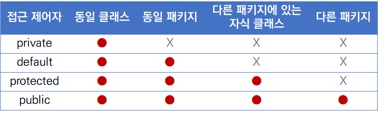

### 💭 9장 정리

---

#### ☑️ 접근제어자

- default는 package-private이라고도 불림

#### ☑️ public class

- public class이면 클래스이름은 무조건 해당 파일이름과 같아야한다.
  - 파일명이 Student.java이면 public class는 Student이여야 함
- public class가 없이 디폴트 class여도 실행됨

---

### 💭 단답형

#### 1. 패키지를 선언할 때 사용하는 예약어는?

- package

#### 2. 패키지 선언은 클래스 소스중 어디에 위치해야 하나요?

- 제일 상단

#### 3. 패키지를 선언할 때 가장 상위 패키지의 이름으로 절대 사용하면 안되는 단어는 무엇인가요?

- java

#### 4. 패키지 이름에 예약어가 포함되어도 되나요?

- X

#### 5. import는 클래스 내에 선언해도 되나요?

- X

#### 6. 같은 패키지에 있는 클래스를 사용할 때 import를 해야 하나요?

- X

#### 7. 특정 패키지에 있는 클래스들을 모두 import할때 사용하는 기호는?

- 별(*)

#### 8. 클래스에 선언되어 있는 static한 메소드나 변수를 import하려면 어떻게 해야하나요?

- import static

#### 9. 접근제어자 중 가장 접근권한이 넓은 것은 무엇인가요?

- public

#### 10. 접근제어자 중 가장 접근권한이 좁은 것은 무엇인가요?

- private

#### 11. 접근제어자 중 같은 패키지와 상속관계에 있는 클래스만 접근할 수 있도록 제한하는 것은?

- protected

#### 12. Calculate.java라는 자바소스가 있을 경우, 그 소스내에는 Calculate라는 클래스외에는 ( )로 선언된 클래스가 있으면 안된다.

- public