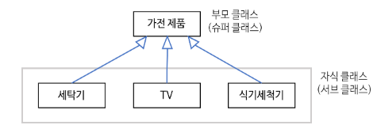

### 💭 10장 정리

---

#### ☑️ 상속 클래스 다이어그램



`자식 클래스 -> 부모 클래스`

#### ☑️ 상속의 특징

- 자식 클래스의 생성자가 호출되면, 자동으로 부모클래스의 매개변수가 없는 생성자가 실행됨
- 부모클래스의 생성자를 명시적으로 호출하려면 `super()`를 사용하면 됨
- 자식클래스에서는 부모클래스에 있는 public, protected로 선언된 모든 인스턴스 및 클래스변수와 메소드를 사용할 수 있음
- 다중 상속은 안됨

#### ☑️ 오버라이딩(Overriding)

- 부모클래스의 메소드와 동일한 시그니처(메소드 이름, 매개변수 타입 및 개수)를 갖는 자식 클래스의 메소드가 존재할 때 성립
- 부모클래스와 동일한 리턴타입을 가져야만 한다
- 접근제어자는 부모클래스에 있는 메소드와 달라도 되지만, 접근권한이 확장되는 경우에만 허용된다. 접근권한이 축소될 경우에는 컴파일에러 발생
- `오버라이딩은 복제, 오버로딩은 확장`

#### ☑️ 참조자료형의 형변환

```java
ParentCasting parent = new ParentCasting();
ChildCasting child = new ChildCasting();

ParentCasting obj1 = new ChildCasting(); // 가능
ChildCasting obj2 = new ParentCasting(); // 불가

// 명시적 형변환이 가능한 경우
ChildCasting child = new ChildCasting();
ParentCasting parent2 = child;
ChildCasting child2 = (ChildCasting)parent2; // 이 경우엔 가능하다
```

- 자식타입의 객체를 부모타입으로 형변환하는 것은 자동으로 된다
- 부모타입의 객체를 자식타입으로 형변환하는 것은 명시적으로 타입을 지정해주어야 한다. 이 때 `부모타입의 실제 객체는 자식타입이어야 한다`.

#### ☑️ instanceof

```java
class InstanceOf{
    public static void main(String[] args) {
        ParentCasting[] parentArray = new ParentCasting[3];
        parentArray[0] = new ChildCasting();
        parentArray[1] = new ParentCasting();
        parentArray[2] = new ChildCasting();

        for (parentCasting tempParent : parentArray) {
            /*
                    여기서 ChildCasting타입이 아닌 ParentCasting타입을 검사해버리면,
                    모두 다 ParentCasting 타입으로 되어버림.(상속을 받았기때문에)
                    따라서 자식타입부터 확인을 해야됨
             */
            if (tempParent instanceof ChildCasting) {
                System.out.println("ChildCasting");
                ChildCasting tempChild = (ChildCasting) tempParent;
                tempChild.printAge();
            }else{
                System.out.println("ParentCasting");
            }
        }
    }
}
```

- instanceof로 타입 확인을 할때 부모타입도 true라는 결과를 제공한다.
- 타입을 점검할 때는 가장 하위에 있는 자식타입부터 확인을 해야 제대로 타입점검이 된다.

#### ☑️ Polymorphism(다형성)

```java
class Polymorphism{
    public static void main(String[] args) {
        // Parent클래스를 상속받은 Child, ChildOther클래스가 존재한다고 가정
        Parent parent1 = new Parent();
        Parent parent2 = new Child();
        Parent parent3 = new ChildOther();
        
        parent1.printName();
        parent2.printName();
        parent3.printName();
        // 결과는 각각 오버라딩한 printName()메소드가 나옴
    }
}
```

- 형 변환을 하더라도, 실제 호출되는 것은 원래 객체에 있는 메소드가 호출됨

---

### 💭 단답형

#### 1. 상속을 받은 클래스의 선언문에 사용하는 키워드는?

- extends

#### 2. 상속을 받은 클래스의 생성자를 수행하면 부모의 생성자도 자동으로 수행되나요?

- O

#### 3. 부모클래스의 생성자를 자식클래스에서 직접 선택하려고 할때 사용하는 예약어는?

- super( )

#### 4. 메소드 Overriding과 Overloading을 정확하게 설명하세요

- 오버라이딩은 상위클래스가 가지고 있는 메소드를 하위클래스에서 재정의해서 사용
- 오버로딩은 같은이름의 메소드 여러개를 가지면서 매개변수의 유형과 개수가 다르게 하도록 하는 것

#### 5. A가 부모, B가 자식클래스라면 `A a = new B();` 형태로 객체 생성이 가능한가요?

- O

#### 6. 명시적으로 형변환을 하기전에 타입을 확인하려면 어떤 예약어를 사용해야 하나요?

- instanceof

#### 7. 6에서 사용한 예약어의 좌측에는 어떤 값이, 우측에는 어떤 값이 들어가나요?

- 좌측에는 참조변수, 우측에는 클래스명

#### 8. 6의 예약어의 수행결과는 어떤타입인가요?

- boolean

#### 9. Polymorphism이란?

- 하나의 객체가 여러가지 타입을 가질수 있는 것