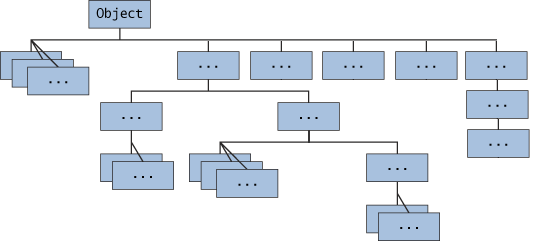
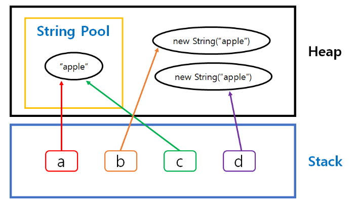

### 💭 12장 정리

---

#### ☑️ Object 클래스



- 자바는 한번에 이중 상속을 받을 수는 없지만, 여러 단계로 상속을 받을 수는 있다.
- 모든클래스는 Object클래스를 상속 받는다.

#### ☑️ toString() 자동 호출되는 경우

- System.out.println( ) 메소드에 매개변수로 들어가는 경우
- 객체에 더하기 연산을 하는 경우

#### ☑️ toString() 오버라이딩
```java
public class MemberDTO{
    // 생략
    public String toString(){
        return "Name=" + name + " Phone=" + phone + " eMail=" + email;
    }
}
```

#### ☑️ equals()

- `==` : 주소 비교
- `equals()` : 값 비교

```java
String a = "apple";
String b = new String("apple");
String c = "apple";
String d = new String("apple");

System.out.println(a==b); // false
System.out.println(a==c); // true

System.out.println(a.equals(b)) // true
```



---

### 💭 단답형

#### ⚠️ 1. 모든 클래스의 최상위 부모 클래스인 Object 클래스는 어떤 패키지에 선언되어 있나요?

- java.lang

#### ⚠️ 2. 클래스가 어떻게 선언되어 있는지 확인할 수 있는 명령어의 이름은?

- javap

#### 3. Object 클래스에 선언되어 있는 모든 메소드는 여러분들이 Overriding해야 하나요?

- X

#### ⚠️ 4. Object 클래스의 clone( ) 메소드의 용도는?

- 객체 복사본을 만들어 반환

#### 5. System.out.println( ) 메소드를 사용하여 클래스를 출력했을 때 호출되는 Object 클래스에 있는 메소드는 무엇인가요?

- toString( )

#### 6. 객체의 주소를 비교하는 것이 아닌, 값을 비교하려면 Object 클래스에 선언되어 있는 어떤 메소드를 Overriding해야 하나요?

- equals( )

#### 7. Object 클래스에 선언되어 있는 hashCode()라는 메소드는 어떤 타입의 값을 리턴하나요?

- int