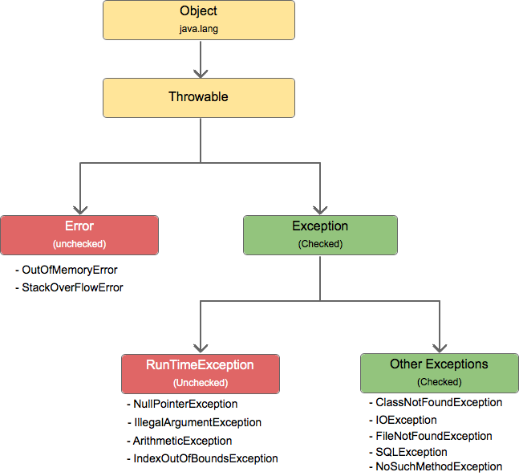

### 💭 14장 정리

---

#### ☑️ 예외처리

```java
class Exception {
    public static void main(String[] args) {
        try {
            // 예외가 발생할 수 있는 문장들
        } catch (Exception e) {
            // 예외가 발생했을 때 처리
        }
    }
}
```

- try-catch에서 예외가 발생하지 않은 경우
  - try에 있는 모든 내용이 실행됨
  - try-catch 이후의 내용이 실행됨
- try-catch에서 예외가 발생한 경우
  - try에 예외가 발생한 이후의 문장들은 실행되지 않음
  - catch 내에 문장은 반드시 실행됨
  - try-catch 이후의 내용이 실행됨
- catch에서 사용하는 변수는 try 블록 앞에 선언해야 한다.
- 임의의 예외클래스를 만들때에는, 반드시 try-catch로 묶어줄 필요가 있는 경우에만 Exception 클래스를 확장한다. 일반적으로 실행시 예외를 처리할 수 있는 경우에는 RuntimeException 클래스를 확장하는 것이 권장사항이다
- catch문 내에 아무런 작업없이 공백을 놔두면 예외분석이 어려워지므로 꼭 로그처리와 같은 예외처리를 해줘야한다

#### ☑️ finally
```java
class Finally{
  public static void main(String[] args) {
      try{
          
      }catch(Exception e){
          
      }finally {
          // finally는 예외가 발생하던 안하던 반드시 실행됨
      }
  }
}
```

#### ☑️ 다중 catch

- 모든 예외의 부모클래스는 `java.lang.Exception`클래스다.
- try 다음에 오는 catch 블록은 1개 이상 올 수 있다
- 먼저 선언한 catch 블록의 예외클래스가 다음에 선언한 catch 블록의 부모에 속하면, 자식에 속하는 catch 블록은 절대 실행될 일이 없으므로 컴파일이 되지 않음
- 마지막 catch 블록에는 Exception클래스로 묶어주는 버릇을 들여 놓는게 안전하다

#### ☑️ error

- 자바 프로그램 밖에서 발생한 예외를 말함



#### ☑️ unchecked exception

- 예외가 발생할 것을 미리 감지하지 못했을때 발생
- 이 런타임 예외에 해당하는 모든 예외들은 RuntimeException을 확장한 예외들이다
- 컴파일시에 체크하지 않고 런타임시에 예외가 발생(runtime exception이라고도 부름)

#### ☑️ throw, throws

```java
class Throws{
    public void throwsException(int number) throws Exception{
        if(number > 12){
            throw new Exception("Number is over than 12"); // 이 함수를 호출한 메소드로 예외가 전달됨
        }
        System.out.println("Number is " + number);
    }
}
```

- 메소드를 선언할 때 매개변수 소괄호 뒤에 throws라는 예약어를 적어 준뒤 예외를 선언하면, 해당 메소드에서 선언한 예외가 발생했을 때 호출한 메소드로 예외가 전달된다.
- 예외를 throw하는 이유는 해당 메소드에서 예외를 처리하지 못하는 상황이거나, 미처 처리하지 못한 예외가 있을경우에 대비하기 위함이다

---

### 💭 단답형

#### 1. 예외를 처리하기 위한 세가지 블록에는 어떤 것이 있나요?

- try, catch, finally

#### 2. 1의 답 중에서 "여기에서 예외가 발생할 것이니 조심하세요"라고 선언하는 블록은?

- try

#### 3. 1의 답 중에서 "예외가 발생하든 안하든 얘는 반드시 실행되어야 합니다"라는 블록은?

- finally

#### 4. 예외의 종류 3가지는 무엇인가요?

- error, runtime exception, checked exception

#### 5. 프로세스에 치명적인 영향을 주는 문제가 발생한 것은?

- error

#### 6. try나 catch 블록 내에서 예외를 발생시키는 키워드는 무엇인가요?

- throw

#### 7. 메소드 선언시 어떤 예외를 던질수도 있다고 선언할때 사용하는 키워드는?

- throws

#### 8. 직접 예외를 만들 때 어떤 클래스의 상속을 받아서 만들어야 하나요?

- Exception