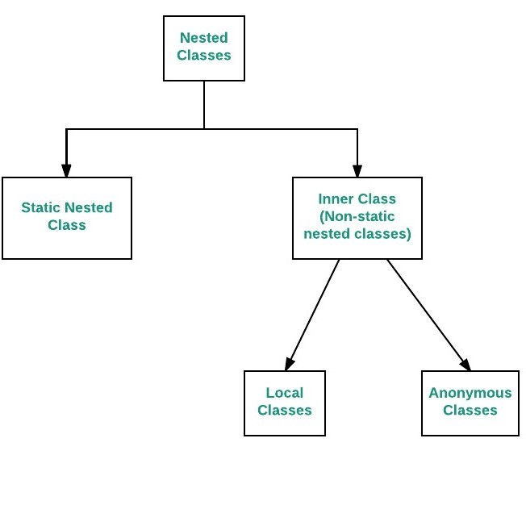

### 💭 16장 정리

---

#### ☑️ Nested Class



- 클래스에 `static 사용여부`에 따라 Static Nested Class와 Inner Class로 구분됨

#### ☑️ Nested Class 사용 이유
- 한 곳에서만 사용되는 클래스를 논리적으로 묶어서 처리할 필요가 있을 때
- 캡슐화가 필요할 때(내부구현을 감추고 싶을 때)
- 소스의 가독성과 유지보수성을 높이고 싶을 때

#### ☑️ Static Nested Class
```java
class OuterOfStatic{
    static class StaticNested{
        private int value = 0;
        public int getValue(){
            return value;
        }
        public void setValue(int value){
            this.value = value;
        }
    }
}

public class Sample{
    public static void main(String[] args) {
        // 객체 생성 방식이 다름
        OuterOfStatic.StaticNested staticNested = new OuterOfStatic.StaticNested();
        staticNested.setValue(3);
        System.out.println(staticNested.getValue());
    }
}
```

- Static Nested 클래스가 static으로 선언되어 있기 때문에, 부모클래스에 static 하지 않은 변수는 참조할 수 없음(클래스 변수만)

#### ☑️ Inner Class

```java
class OuterOfInner{
    class Inner{
        private int value = 0;
        public int getValue(){
            return value;
        }
        public void setValue(int value){
            this.value = value;
        }
    }
}

public class Sample{
    public static void main(String[] args) {
        // 객체 생성 방식이 다름
        OuterOfInner outer = new OuterOfInner();
        OuterOfInner.Inner inner = outer.new Inner();
        inner.setValue(3);
        System.out.println(inner.getValue());
    }
}
```

#### ☑️ Anonymous Class

```java
class MagicButton {
    public MagicButton() {

    }

    private EventListener listener;

    public void setListener(EventListener listener) {
        this.listener = listener;
    }
}

public interface EventListener {
    public void onClick();
}

public class Sample {
    public static void main(String[] args) {
        MagicButton button = new MagicButton();
        button.setListener(new EventListener() {
            @Override
            public void onClick() {
                System.out.println("Magic Button Clicked!!");
            }
        });
    }
}
```

- 익명클래스나 내부클래스는 모두 다른 클래스에서 재사용할 일이 없을때 만든다(`일회용`)
- static nested 클래스와 다르게, 내부클래스와 익명클래스는 감싸고 있는 클래스의 어떤 변수라도 참조가능(클래스 변수, 인스턴스 변수 둘다가능)

---

### 💭 단답형

#### 1. Nested 클래스에 속하는 3가지 클래스는?

- Static Nested, Inner, Anonymous

#### ⚠️ 2. Nested 클래스를 컴파일하면 Nested 클래스 파일의 이름은 어떻게 되나요?

- $가 붙는다
```
외부클래스명$내부클래스명.class
```

#### ⚠️ 3. Static Nested 클래스는 다른 Nested 클래스와 어떤 차이가 있나요?

- 인스턴스 없이 내부 클래스의 인스턴스를 바로 생성할 수 있음

#### 4. Static Nested 클래스의 객체 생성은 어떻게 하나요?

```
바깥클래스.안쪽클래스 객체명 = new 바깥클래스.안쪽클래스();

OuterOfStatic.StaticNested staticNested = new OuterOfStatic.StaticNested();
```

#### ⚠️ 5. 일반적인 내부 클래스의 객체 생성은 어떻게 하나요?

```
바깥클래스 객체명1 = new 바깥클래스();
바깥클래스.안쪽클래스 객체명2 = 객체명1.new 안쪽클래스();

OuterOfInner outer = new OuterOfInner();
OuterOfInner.Inner inner = outer.new Inner();
```

#### ⚠️ 6. Nested 클래스를 만드는 이유는?

- 코드를 간단하게 표현하기 위해서

#### 7. Nested 클래스에서 감싸고 있는 클래스의 private으로 선언된 변수에 접근할 수 있나요?

- O

#### 8. 감싸고 있는 클래스에서 Nested 클래스에 선언된 private로 선언된 변수에 접근할 수 있나요?

- O