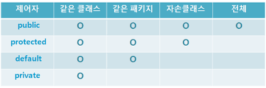

### 💭 18장 정리 <중간점검>

---

#### ☑️ 클래스

- "상태"와 "행위"를 갖는 자바의 기본 단위

#### ☑️ 상태와 행위

- 상태는 클래스나 인스턴스 변수 표현
- 행위는 메소드로 표현

#### ☑️ 캡슐화

- 연관된 상태와 행위를 결정하는 기능을 묶어주는 것을 의미
- 클래스 밖에서 접근가능한 대상을 제한하는 정보은닉이 가능
- 모듈화 가능
```java
public class Common{
    private int state; // 정보은닉
    public void setState(int newState){ // 메소드를 통해 상태 변경가능
        this.state = newState;
    }
}
```

#### ☑️ 메시지

- 메소드에서 다른 메소드를 호출할 때 전달하는 값
- 매개변수들이 메시지에 속함

#### ☑️ 객체

- 클래스는 사물의 단위를 의미하지만, 객체는 각 사물을 의미함
```java
Book godOfJava = new Book();
```

#### ☑️ 상속

- 부모에 선언된 변수나 메소드에 대한 사용권을 갖는 것
- 클래스 선언시 extends를 사용하여 확장하거나, implements를 사용하여 구현한 경우

#### ☑️ 다형성

- 부모클래스에서 파생된 자식클래스들의 기능이 각기 다를 수 있다는 것
```java
// FirstChild와 SecondChild가 Parent를 상속받고, 오버라이딩한 method()의 내용이 다를때
Parent first = new FirstChild();
Parent second = new SecondChild();

// 같은 Parent 타입이어도 결과는 다를 수 있음
first.method();
second.method();
```

#### ☑️ 오버라이딩

- 부모 클래스에 선언되어 있는 메소드와 동일한 선언을 갖지만, 구현이 다른것
- 다형성을 제공하는 방법중 하나

#### ☑️ 오버로딩

- 메소드의 이름은 동일해도, 매개변수들을 다르게 하는 것
- 동일한 기능을 하지만, 메소드에 넘겨줄 수 있는 매개변수의 타입을 다양하게 함으로써, 메소드를 사용하는 다른 개발자가 쉽게 구현할 수 있게 해줌
```java
public class Overloading{
    public void getData(){
        
    }
    public void getData(int value){

    }
    public void getData(String value){

    }
}
```
#### ☑️ 주석

```java
// 한줄주석

/*
   블록주석
 */

/**
 * javadoc을 위한 주석 : API 문서에 설명을 표시할 목적
 */
```

#### ☑️ 패키지

- 클래스들을 그룹화하기 위한 단위
```java
package com.roadbook.godofjava;
```

#### ☑️ import

- 다른 패키지에 있는 클래스를 사용하기 위한 문장
- 다른 클래스에 static으로 선언되어 있는 접근 가능한 변수를 참조하려면 import static을 사용
- 하나의 패키지 내에 있는 모든 클래스를 참조하려면 *을 사용
```java
import com.roadbook.godofJava.SummaryClass;
import static com.roadbook.godofJava.SummaryClass.SUMMARY_CHAPTER_NUMBER;
import com.roadbook.godofJava.exception.*;
```

#### ☑️ 기본자료형

- 정수형 : byte, short, int, long, char
- 소수형 : float, double
- 기타 : boolean

#### ☑️ 참조자료형

- 기본 자료형을 제외한 모든 타입
- 모든 클래스는 참조자료형이다
- String클래스는 new를 이용하여 객체를 생성할 필요가 없는 특수 클래스이다. 그리고, +연산까지 가능한 유일한 클래스이다

#### ☑️ 기본자료형, 참조자료형 차이

- 초기화 할때
  - 기본자료형은 값을 바로지정
  - 참조자료형은 일반적으로 new와 생성자를 지정하여 객체를 생성
- 메소드 호출할 때 매개변수
  - 기본자료형 및 참조자료형 모두 값을 전달하지만, 참조자료형 안에 있는 변수들은 참조 주소를 전달함

#### ☑️ 변수

- 지역변수 : 지역변수를 선언한 곳에서부터 생명이 시작되고, 지역변수를 선언한 중괄호가 끝나면 소멸
- 매개변수 : 메소드가 호출될 때 생명이 시작되고, 메소드가 끝나면 소멸
- 인스턴스 변수 : 객체가 생성될 때 생명이 시작되고, 그 객체를 참조하고 있는 다른 객체가 없으면 소멸
- 클래스 변수 : 클래스가 생성될 때 생명이 시작되고, 자바 프로그램이 끝나면 소멸
```java
public class VariableTypes{
    int instanceVariable;
    static int classVariable;
    public void method(int parameter){
        int localVariable;
    }
}
```

#### ☑️ 삼항 연산자

```java
변수 = (boolean 조건식) ? true일때의 값 : false일때의 값;
```

#### ☑️ 조건문
```java
class Condition{
    if(boolean값){
        // 처리문장
    }
    
    if(boolean값){
        // 처리문장1
    }else{
        // 처리문장2
    }
    
    if(boolean값){
        // 처리문장1
    }else if(boolean 값){
        // 처리문장2
    }else if(boolean 값){
        // 처리문장3
    }else{
        // 처리문장4
    }
    
    switch(비교대상 변수){
        case 점검값1:
            // 처리문장1
            break;
        case 점검값1:
            // 처리문장2
            break;
        default:
            // 처리문장3
            break;
    }
}
```

#### ☑️ 반복문

```java
class Loop{
    while(boolean조건이 true인 경우 실행){
        // 처리문장
    }
    
    do{
        // 처리문장
    }while(boolean조건이 true인 경우 실행);
    
    for(초기화; 종료조건; 조건값 증가){
        // 반복문장
    }
}
```

#### ☑️ break

- 조건문이나 반복문의 중간에서 하던 작업을 중단할 필요가 있을 때

#### ☑️ continue

- 반복문에서 중간에서 하던 작업을 중단하고, 조건을 확인하는 부분으로 바로 이동하기 위해 사용

#### ☑️ 접근제어자



- public : 누구나 접근 가능
- protected : 같은패키지 내에 있거나, 상속받은 경우에만 사용가능
- package-private : 같은패키지 내에 있을때만 접근가능
- private : 해당 클래스 내에서만 접근 가능

#### ☑️ 인터페이스

```java
public interface InterfaceA{
    public void methodA();
    public void methodB();
}
```

- 어떤 메소드가 존재해야 하는지에 대한 선언만 존재
- 절대로 구현되어 있는 메소드가 있어서는 안됨
- 인터페이스를 구현하는 클래스에서는 implements를 사용하여 선언

#### ☑️ 추상클래스

```java
public abstract class AbstractClass{
    public abstract void methodA();
    public void methodD(){
        System.out.println("메소드 D!");
    }
}
```

- 구현되어 있는 메소드가 있어도 상관없음
- abstract로 선언된 메소드가 1개 이상일 경우에는 반드시 abstract 클래스로 선언
- abstract로 선언된 메소드는 절대로 구현되어 있어서는 안됨
- abstract 클래스를 확장하는 클래스에서는 extends를 사용하여 선언

#### ☑️ enum클래스

```java
public enum EnumClass{
    THREE_HOUR(3),
    FIVE_HOUR(5)
}
```

- 상수를 열거하기 위한 용도로 사용
- 상수는 이름만 정의해도 됨
- 별도의 생성자를 만들어 각 상수의 값을 지정할 수 있음
- 메소드를 만들어 기능 추가 가능

#### ☑️ 상속
- `생성자`
  - 자식클래스의 생성자가 호출되면 자동으로 부모클래스의 매개변수가 없는 기본생성자가 호출됨
  - 명시적으로 super()라고 지정가능
- `메소드`
    - 부모클래스에 선언된 메소드들이 자신의 클래스에 선언된 것처럼 사용가능(private 제외)
    - 부모클래스에 선언된 메소드와 동일한 시그니처를 사용함으로써 오버라이딩 가능
    - 부모클래스에 선언되어 있지 않은 이름의 새로운 메소드 선언 가능
- `변수`
  - 부모클래스에 private으로 선언된 변수를 제외한 모든 변수가 자신의 클래스에 선언된 것처럼 사용가능
  - 부모클래스에 선언된 변수와 동일한 이름을 가지는 변수 선언가능(권장하지 않음)
  - 부모클래스에 선언되어 있지 않는 이름의 변수 선언 가능

#### ☑️ 예외
```java
class Exception{
    try{
        // 예외가 발생가능한 문장
    }catch(예외1 e1){
        // 예외1 발생했을때 처리문장
    }catch(예외2 e2){
        // 예외2 발생했을때 처리문장
    }finally{
        // try나 catch가 어떻게 수행되었든 간에 수행되는 문장
    }
}
```

#### ☑️ 예외의 종류

- checked exception : try-catch로 묶어줘야하는 예외, 컴파일시 예외 처리여부를 체크함
- runtime exception : try-catch로 묶지 않아도 컴파일시 체크하지 않는 예외, 실행시 발생하는 예외
- error : 자바 프로세스에 영향을 주는 예외이며 실행할때 발생

#### ☑️ throw, throws

- throw : 예외 객체를 던지기 위해 사용한다
- try 블록 내에서 예외를 발생시킬 경우에는 throw라는 예약어를 적어 준뒤 예외객체를 생성하거나, 생성되어있는 객체를 명시
- throws : 예외가 발생하면 던질 것이라고 메소드 선언시 사용
- throws라는 예약어를 적어 준뒤 예외를 선언하면 해당 메소드에서 선언한 예외가 발생하면 호출한 메소드로 예외가 전달됨
- 두 가지 이상의 예외를 던지게 된다면 콤마로 구분하여 예외 클래스 이름을 적어줌
- throw한 예외클래스가 catch 블록에 선언되어 있지 않거나, throws선언에 포함되어 있지 않으면 컴파일 에러 발생
- catch 블록에서 예외를 throw한 경우에는 메소드 선언의 throws 구문에 해당 예외가 정의되어 있어야 함

#### ☑️ Object 클래스

- 모든 클래스의 가장 최상위 부모 클래스
- 이 클래스에 선언되어 있는 모든 메소드들은 자바에서 사용하는 모든 클래스에서 사용가능
```
# Object클래스의 주요 메소드
clone() : 객체의 복사본을 만들어 리턴
equals() : 현재 객체와 매개변수로 넘겨받은 객체가 같은지 확인
finalize() : 현재 객체가 더 이상 쓸모가 없어졌을때 GC에 의해서 이 메소드가 호출됨
getClass() : 현재 객체의 Class를 리턴
hashCode() : 객체에 대한 해시코드값을 리턴
toString() : 객체를 문자열로 표현하는 값을 리턴
wait(), notify(), notifyAll() : 쓰레드 처리시 사용하는 메소드
```

#### ☑️ String 클래스

- 더하기 연산이 가능
- 더하기 연산을 할 경우 String클래스는 기존 문자열은 버리고 새로운 객체를 생성

```
# String클래스의 주요 메소드
getBytes() : 문자열을 byte배열로 변경
length() : 문자열의 길이를 리턴
isEmpty() : 문자열이 비어있는지를 확인
equals() : 두 문자열의 값이 같은지 확인
startsWith(), endsWith() : 매개 변수로 넘어온 문자열로 시작하는지, 끝나는지 확인
contains() : 매개변수로 넘어온 문자열이 포함되어 있는지 확인
indexOf(), lastIndexOf() : 매개변수로 넘어온 문자열이 있는 위치를 0부터 시작하는 값으로 리턴, 없으면 -1 리턴
subString(), subsequence() : 문자열의 특정 범위값을 잘라서 리턴
split() : 문자열을 매개변수로 넘어온 정규표현식에 따라서 String배열로 리턴
concat() : 기존 문자열 뒤에 매개변수로 넘어온 문자열을 합침
trim() : 문자열의 맨앞과 맨뒤에 있는 공백을 제거
replace() : 문자열의 특정 위치의 내용을 매개변수로 넘어온 값으로 변경
format() : 문자열을 정해진 포맷으로 변환
intern() : 절대로 써서는 안되는 메소드
```

#### ☑️ StringBuffer, StringBuilder

- String의 단점을 보완하기 위해서 제공되는 클래스
- StringBuffer는 쓰레드에 안전하고, StringBuilder는 그렇지 못함
- append() 메소드를 사용하여 문자열을 더할 수 있음
- 문자열을 더하면 컴파일러에서 StringBuilder 클래스로 변환함

---

### 💭 단답형

#### 1. 참조자료형과 기본자료형의 차이를 정리해주세요

- 참조자료형은 객체 생성시 new를 이용해야 함, 기본자료형은 바로생성
- 메소드를 호출할 때 참조자료형은 주소를 전달

#### 2. 기본자료형 8가지를 나열하고, 각 타입의 특징을 정리해주세요

- 정수형 : byte, short, int, long, char
- 소수형 : float, double
- 기타 : boolean

#### 3. 형 변환이란 무엇이고 왜 해야 하나요?

- 타입을 바꾸는 것
- 형변환 하지 않으면 값이 바뀔수 있기 때문에

#### 4. if문의 용도는 무엇이며, if-else와 if-else if는 어떤점이 다른지 정리해주세요

- 조건문
- if-else는 if문이 아니면 무조건 else에 있는 처리내용을 실행
- if-else if는 if문이 아니면 else if에 있는 boolean식이 참일경우에만 해당 처리내용 실행, 아니면 지나감

#### ⚠️ 5. switch-case문의 용도를 정리해주세요

- 하나의 값이 여러 범위에 걸쳐서 비교되어야 할때 사용

#### 6. for, do-while, while을 어떻게 사용하는지 1부터 10까지 더하는 코드를 예로 들어서 정리해주세요

```java
class Example{
    total = 0;
    for(int i=1; i<=10; i++){
        total += i;
    }
    
    total = 0;
    int i = 0;
    do{
        i++;
        total += i;
    }while(i < 10);
    
    total = 0;
    i = 0;
    while(i < 10){
        i++;
        total += i;
    }
}
```

#### 7. 지금까지의 자신의 학점이나 등수를 String 배열에 넣고 출력하는 코드를 작성해주세요.
```java
class Example{
    String[] arr = {"A+", "B-", "A0"};
    for(String str : arr){
        System.out.println(str);
    }
}
```

#### 8. 생성자는 무엇을 하는 데 사용하는 것이며, 별도로 만들지 않아도 자동으로 생성되는 생성자에 대해서 정리해주세요

- 객체를 초기화 하는데 사용
- 생성자를 선언하지 않으면, 매개변수가 없는 생성자가 자동으로 생성됨, 단 매개변수가 있는 생성자가 별도로 존재하면 생성되지 않음

#### 9. 오버로딩은 무엇인가요? public void setData(int a)라는 메소드를 오버로딩 해주세요

- 메소드의 이름은 동일하고, 매개변수를 다르게 한 것

```java
public void setData(String a){}
public void setData(int a, int b){}
```

#### ⚠️ 10. 패키지를 선언하는 위치와 이름을 지정할 때의 유의점을 정리해주세요

- 패키지 선언시 가장 윗부분에 선언해야 함
- 하위 패키지로 내려갈때마다 .을 표기
- 소문자로 작성하며 자바 예약어를 사용하면 안됨

#### 11. 다른 패키지에 선언된 클래스를 사용하기 위한 import는 어디 위치에 선언해야하며, static import는 무엇인지 정리해주세요

- import는 가장 윗부분 패키지선언 바로밑에 선언
- static import는 다른 클래스에 존재하는 static한 변수나 메소드를 import할때 사용

#### ⚠️ 12. 클래스란 무엇인가요?

- 속성과 상태의 집합
- 속성은 클래스나 인스턴스 변수로, 행위는 메소드로 표현

#### 13. 인터페이스, abstract클래스, 클래스, enum클래스의 각각의 특징 및 다른점을 정리해주세요

- 인터페이스는 메소드의 구현이 되어있지 않다
- 추상클래스는 추상메소드가 최소 1개이상 있다
- 클래스는 모든메소드가 구현되어 있다
- enum클래스는 상수를 열거하기 위한 클래스이다

#### ⚠️ 14. instanceof 라는 연산자의 용도를 정리해주세요

- 객체.instanceof(비교객체) 구조로 사용
- 객체와 비교객체 타입이 일치하는지 boolean형으로 반환
- 부모타입도 true를 반환하기 때문에, 가장 하위에있는 자식타입부터 확인해야 제대로된 타입확인이 가능

#### 15. 어떤 클래스를 상속받아 확장하면, 부모클래스의 어떤것들을 사용할 수 있는지 정리해주세요

- private으로 선언되어 있지않은 메소드, 변수 사용가능

#### 16. 변수를 final로 선언하는것은 어떤의미인가요?

- 값 변경 불가, 변수생성과 동시에 값을 할당해야됨

#### 17. 클래스를 final로 선언하는 것은 어떤 의미인가요?

- 상속 불가

#### ⚠️ 18. 변수를 static으로 선언하는것은 어떤 의미인가요?

- 클래스가 처음 호출될 때 생명이 시작되고 자바 프로그램 종료시 소멸
- 객체의 생성없이 바로 접근 가능

#### 19. 메소드를 static으로 선언하는것은 어떤의미?

- 객체생성하지 않고 바로 클래스명으로 접근가능
- 클래스변수만 사용가능

#### 20. try-catch-finally 블록은 왜 사용하고 각각의 블록이 어떤 용도인지?

- 예외를 처리하기 위해 사용
- try는 예외가 발생할 수 있는 영역
- catch는 예외발생시 실행되는 영역
- finally는 예외가 발생하던 안하던 실행되는 영역