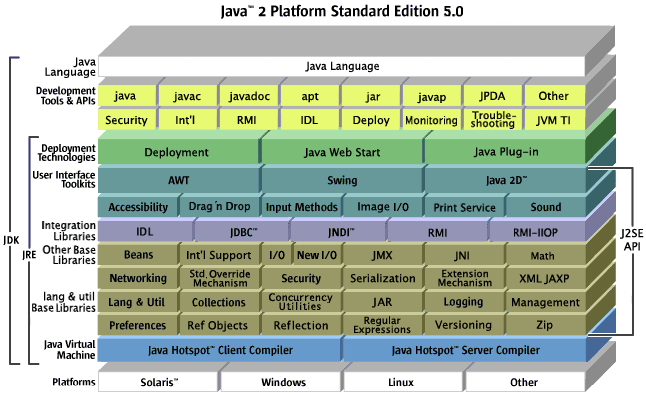
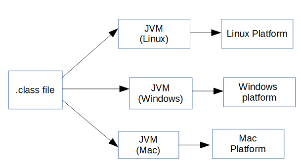
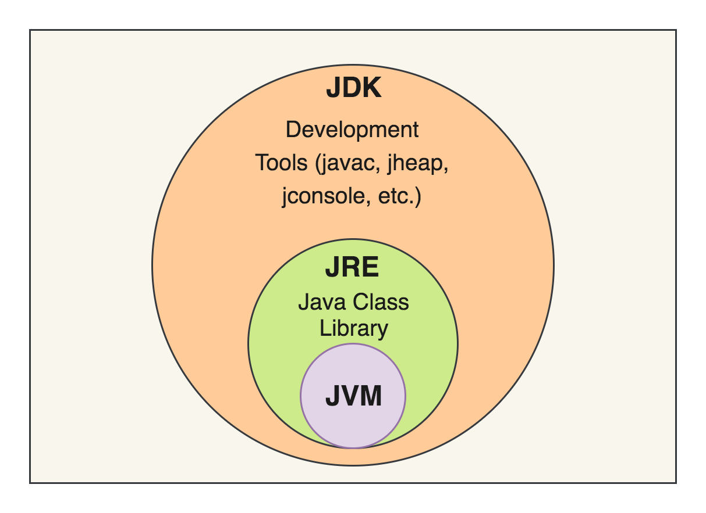
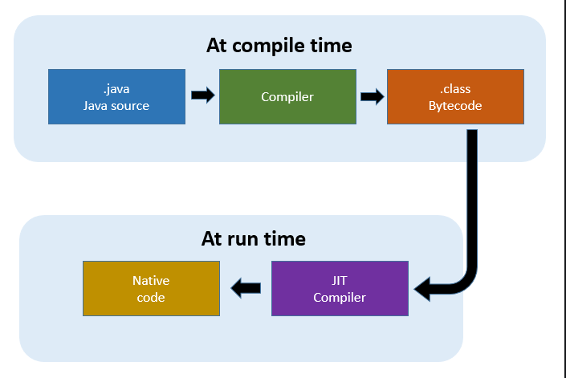

### 💭 19장 정리

---

#### ☑️ JDK

- Java Development Kit
- Java를 사용하기 위해 필요한 모든 기능을 갖춘 Java용 SDK이다
- 프로그램을 생성하고 컴파일 할 수 있음
- JDK는 JRE를 포함하고 있음

#### ☑️ JRE

- Java Runtime Environment
- 자바가상머신, 자바 클래스라이브러리, 자바 명령 및 기타 인프라를 포함한 컴파일된 Java프로그램을 실행하는 데 필요한 패키지

#### ☑️ JVM

- Java Virual Machine
- OS에 종속받지 않고 CPU가 자바를 인식하여 실행할 수 있게 하는 가상 컴퓨터

#### ☑️ JIT

- Just-In-Time
- 바이트코드를 CPU로 직접보낼수 있는 명령어로 바꾸는 프로그램