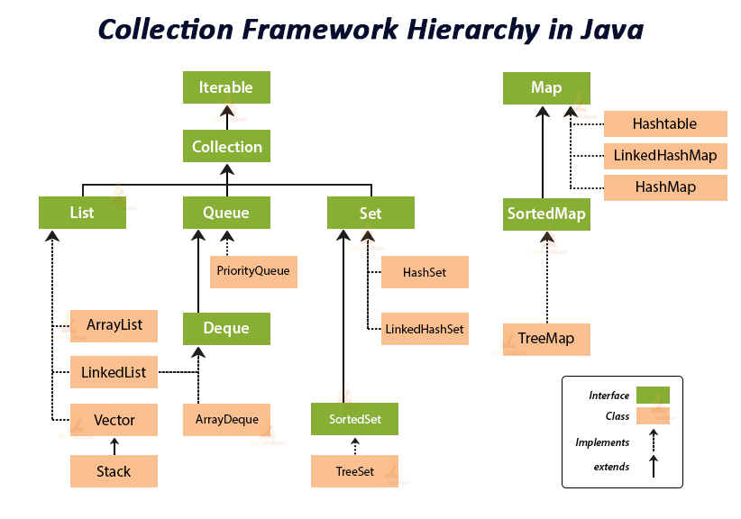

### 💭 22장 정리

---

#### ☑️ 자료구조



- List : 순서가 있는 목록
- Set : 순서가 중요하지 않음
- Queue : 먼저들어온것이 먼저나감
- Map : 키-값으로 저장됨

#### ☑️ List

- 배열처럼 순서가 있다
  - ex) ArrayList, LinkedList, Vector, Stack
- Vector와 ArrayList는 비슷함, 확장 가능한 배열이라고 생각하면 됨
- Vector는 Thread safe(여러명이 객체 값을 변경하려해도 문제안생김)
- ArrayList는 Not Thread safe(여러명이 객체 값을 변경하려면 문제생김)
- Stack은 Vector를 확장한 것, LIFO지원

#### ☑️ ArrayList

```java
import java.util.ArrayList;

// 가능은 하다
// ArrayList list1 = new ArrayList();
// list1.add(new Object());
// list1.add("Array");
// list1.add(new Double(1.0));

ArrayList<String> list1 = new ArrayList<String>();
// JDK 7부터 생성자를 호출하는 부분에 타입을 안적어도 됨
ArrayList<String> list1 = new ArrayList<>();
```

- 보통은, 서로 다른 종류의 객체를 하나의 배열에 넣지 않고, 한가지 종류의 객체만 저장한다.
- 여러 종류의 객체를 담을 때는 DTO라는 객체를 하나 만들어서 담는게 좋다
- 컬렉션 관련 객체들을 선언할 때에는 제네릭을 사용하여 선언하는 것을 권장함
- ArrayList 객체를 선언할 때, 매개변수를 넣지않으면 초기크기는 10이됨
- 10개 이상의 데이터가 들어가면 크기를 늘리는 작업이 자동으로 수행됨
- 중복데이터 허용

#### ☑️ ArrayList의 삽입 메소드

```
add(E e) : 데이터를 가장 끝에 담는다
add(int index, E e) : index 위치에 담고 나머지는 뒤로 밀림
addAll(Collection<? extends E> c) : 컬렌션을 가장끝에 담는다
addAll(int index, Collection<? extends E> c) : index 위치에 담고 나머지는 뒤로 밀림
```

```java
// 객체 복사
ArrayList<String> list2 = new ArrayList<>(list1);

// 값만 사용하는 게 아닌, 참조되고 있는 주소를 사용함(하나의 객체가 변경되면 다른 객체의 내용도 바뀜)(Shallow copy)
ArrayList<String> list2 = list1;
```

#### ☑️ Shallow copy, Deep copy

- Shallow copy : `list2 = list`와 같이 다른 객체에 원본 객체의 주소값만을 할당
- Deep copy : `arraycopy()`, 객체의 모든 값을 복사하여, 복제된 객체에 있는 값을 변경해도 원본에 영향이 없음

#### ☑️ ArrayList의 추출 메소드

```
size() : 데이터의 개수를 리턴
get(int index) : 지정한 위치에 있는 데이터를 리턴
indexOf(Object o) : 데이터의 위치를 리턴
lastIndexOf(Object o) : 뒤에서부터 데이터의 위치를 리턴
toArray() : Object[] 배열로 만듬
toArray(T[] a) : T타입의 배열로 만듬(추천)
```

```java
import java.util.ArrayList;

ArrayList<String> list = new ArrayList<>();
list.add("A");
String[] strList = list.toArray(new String[0]);
```

#### ☑️ ArrayList의 삭제 메소드
```
clear() : 모든 데이터를 삭제
remove(int index) : 지정위치 데이터 삭제
remove(Object o) : 동일한 첫 데이터 삭제
removeAll(Collection<?> c) : 컬렉션과 동일한 모든 데이터 삭제

-- 값 변경 메소드
set(int index, E element) : 지정한 위치에 있는 데이터를 변경
```

#### ☑️ Stack 메소드

```
empty() : 객체가 비어있는지 확인
peek() : 객체의 가장 위 데이터 리턴
pop() : 객체 가장 위 데이터 삭제
push(E item) : 가장 위에 저장
search(Object o) : 데이터의 위치 리턴
```

---

### 💭 단답형

#### 1. Collection 인터페이스를 구현하는 대표적인 3개의 자료구조는?

- List, Set, Queue

#### 2. 배열과 같이 순서가 있는 목록형을 나타내는 인터페이스는?

- List

#### 3. ArrayList라는 클래스의 생성자 중 매개변수가 없는 기본생성자를 사용하면 기본적으로 몇개의 저장공간을 가지나요?

- 10

#### 4. 만약 ArrayList 클래스의 저장공간의 개수를 처음부터 지정하려면 어떤 생성자를 사용하면되나요?

```java
ArrayList(int initialCapacity){

}
```

#### ⚠️ 5. ArrayList 객체를 생성할 때 제네릭을 사용하는 이유는 무엇인가요?

- 컴파일 시점에 잘못 지정한 타입을 걸러낼 수 있기 때문에

#### 6. ArrayList에 데이터를 담는 메소드 이름 두가지는?

- add(), addAll()

#### 7. Collection 인터페이스를 구현한 클래스의 객체에서 사용할 수 있는 for 루프의 구조는?

```java
for(타입 변수 : 객체)

for(String str : list){
  System.out.println(str);
}
```

#### 8. Collection 인터페이스를 구현한 클래스의 객체크기를 확인하는 메소드의 이름은?

- size()

#### ⚠️ 9. ArrayList에서 특정위치에 있는 데이터를 확인하는 메소드는?

- get()

#### 10. ArrayList에서 특정위치에 있는 데이터를 삭제하는 메소드는?

- remove()

#### 11. ArrayList에서 특정위치에 있는 데이터를 수정하는 메소드는?

- set()

#### 12. java.util 패키지에 있는 Stack이라는 클래스는 어떤 클래스를 확장한 것인가?

- List 인터페이스를 구현하며, Vector 클래스를 상속받음

#### 13. Stack 클래스에서 데이터를 담는 메소드는?

- push()

#### 14. Stack 클래스에서 가장 위에 있는 데이터를 확인만 하는 메소드는?

- peek()

#### 15. Stack 클래스에서 가장 위에 있는 데이터를 삭제하고 리턴하는 메소드는?

- pop()