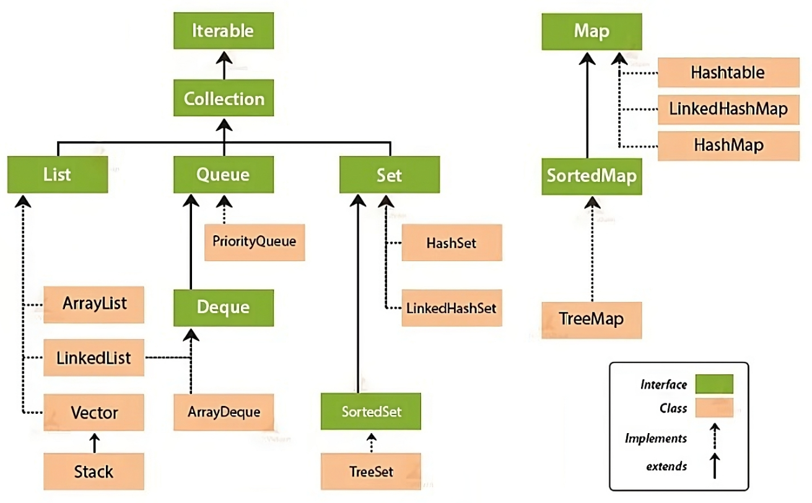

### 💭 23장 정리

- Set
- Queue
- LinkedList

#### 참고링크

[컬렉션 인터페이스](https://inpa.tistory.com/entry/JCF-%F0%9F%A7%B1-Collections-Framework-%EC%A2%85%EB%A5%98-%EC%B4%9D%EC%A0%95%EB%A6%AC#collection_%EC%9D%B8%ED%84%B0%ED%8E%98%EC%9D%B4%EC%8A%A4)

---



#### ☑️ Set

- 순서에 상관없이 어떤 데이터가 존재하는지를 확인하기 위한 용도
- 데이터 중복을 허용하지 않고 순서를 유지하지 않음
- 순서 자체가 없으므로 인덱스로 객체를 검색해서 가져오는 get메소드도 존재하지 않음
- 중복저장이 불가능하기 때문에 Null값도 하나만 저장가능
- 정렬여부에 따라 성능차이가 발생함
- `HashSet`
  - 순서가 전혀 필요 없는 데이터를 해시테이블에 저장
  - Set중에 가장 성능이 좋음
- `TreeSet`
  - 저장된 데이터의 값에 따라서 정렬
  - red-black트리 타입으로 저장
  - HashSet보다 약간 성능이 느림
- `LinkedHashSet`
  - 연결된 목록 타입으로 구현된 해시테이블에 데이터를 저장
  - 저장된 순서에 따라서 값이 정렬
  - 성능이 가장 나쁨

#### ☑️ HashSet

```
# HashSet의 주요 메소드

add(E e) : 데이터를 추가
clear() : 모든 데이터 삭제
clone() : HashSet 객체를 복제, 하지만 담겨있는 데이터들은 복제하지 않음
contains(Object o) : 지정한 객체가 존재하는지를 확인
isEmpty() : 데이터가 있는지 확인
iterator() : 데이터를 꺼내기 위한 Iterator 객체를 리턴
remove(Object o) : 매개변수로 넘어온 객체를 삭제
size() : 데이터의 개수를 리턴
```

#### ☑️ LinkedHashSet

- 순서를 가지는 Set 자료구조

#### ☑️ TreeSet

- 중복허용하지 않고 순서를 가지지않음
- 데이터를 `정렬`하여 저장함

#### ☑️ Queue

- FIFO(First In First Out)
- Deque(Double Ended Queue)
- 여러 쓰레드에서 들어오는 작업을 순차적으로 처리할 때 많이 사용

#### ☑️ LinkedList

- LinkedList는 여러 종류의 인터페이스를 구현했기 때문에 중복된 기능을 수행하는 메소드가 많다
  - List, Queue 등

```
# LinkedList의 삽입 메소드

addFirst(Object) : LinkedList 객체의 가장 앞에 데이터를 추가
offerFirst(Object)
push(Object)

add(Object) : LinkedList 객체의 가장 뒤에 데이터를 추가
addLast(Object)
offer(Object)
offerLast(Object)

add(int, Object) : 특정 위치에 데이터를 추가
set(int, Object) : 특정 위치에 있는 데이터를 수정
addAll(Collection) : 매개변수로 넘긴 컬렉션의 데이터를 추가
addAll(int, Collection) : 매개변수로 넘긴 컬렉션의 데이터를 지정된 위치에 추가
```

```
# LinkedList의 특정위치 꺼내는 메소드

getFirst() : 객체의 맨 앞에 있는 데이터를 리턴
peekFirst()
peek()
element()

getLast() : 객체의 맨 뒤에 있는 데이터를 리턴
peekLast()

get(int) : 객체의 지정한 위치에 있는 데이터를 리턴
```

```
# LinkedList의 어떤 객체가 포함되었는지 확인하는 메소드

contains(Object) : 매개변수로 넘긴 데이터가 있을 경우 true 리턴

indexOf(Object) : 매개변수로 넘긴 데이터의 위치를 앞에서부터 검색하여 리턴, 없으면 -1 리턴

lastIndexOf(Object) : 매개변수로 넘긴 데이터의 위치를 끝에서부터 검색하여 리턴, 없으면 -1 리턴
```

```
# LinkedList의 삭제 메소드

remove() : 객체의 가장 앞에 있는 데이터를 삭제하고 리턴
removeFirst()
poll()
pollFirst()
pop()

removeLast() : 객체의 가장 끝에 있는 데이터를 삭제하고 리턴
pollLast()

remove(int) : 매개변수에 지정된 위치에 있는 데이터를 삭제하고 리턴

remove(Object) : 매개변수로 넘겨진 객체와 동일한 데이터 중 앞에서부터 가장 처음 발견된 데이터를 삭제
removeFirstOccurrence(Object)

removeLastOccurrence(Object) : 매개변수로 넘겨진 객체와 동일한 데이터 중 끝에서부터 가장 처음 발견된 데이터를 삭제
```

---

### 💭 단답형

#### 1. 순서와 상관없이 여러 데이터를 하나의 객체에 저장할 때 사용하는 Collection의 하위 인터페이스는 무엇인가요?

- Set

#### 2. HastSet 클래스는 생성자를 통하여 저장 가능한 데이터의 초기 크기를 지정할 수 있나요?

- O

#### 3. HastSet 클래스의 객체에 데이터를 추가하는 메소드는 무엇인가요?

- add()

#### 4. HashSet 클래스의 객체에 어떤 데이터가 존재하는지 확인하는 메소드는 무엇인가요?

- 지정한 객체가 존재하는 지 확인 : contains(Object o)
- 데이터가 있는지 확인 : isEmpty()

#### 5. HashSet 클래스의 객체에 어떤 데이터를 삭제하는 메소드는 무엇인가요?

- remove()

#### 6. Queue는 FIFO를 처리하기 위한 클래스들의 인터페이스이다. FIFO는 무슨단어의 약어인가요?

- First In First Out

#### ⚠️ 7. Deque는 무슨 단어의 약어이며, 용도는 무엇인가요?

- Double Ended Queue
- Queue의 기능을 포함하며, 맨앞에 값을 넣거나 빼는 작업 및 맨끝에 값을 넣거나 빼는 작업을 용이하게 수행하기 위해서 사용

#### ⚠️ 8. LinkedList 클래스의 특징을 이야기해 봅시다

- 각 노드가 데이터와 포인터를 가지고 한 줄로 연결되는 방식으로 데이터를 저장하는 자료구조
- 데이터를 담고 있는 노드들이 연결되어 있는데, 노드의 포인터가 다음이나 이전의 노드와의 연결을 담당