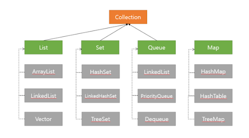

### 💭 24장 정리
- Map
- Properties

---



#### ☑️ Map

- 모든 데이터는 키와 값이 존재한다
- 키가 없이 값만 저장될 수는 없다
- 값없이 키만 저장할 수도 없다
- `키는 해당 Map에서 고유해야만 한다`
- 값은 Map에서 중복되어도 전혀 상관없다
- 데이터 추가 순서는 중요하지 않다(Set과 동일) => 저장순서가 유지되지 않음
- 값은 중복되서 저장될 수 있다
- 기존에 저장된 데이터와 중복된 키와 값을 저장하면 기존의 값은 없어지고 마지막에 저장된 값이 남게됨

```
# Map의 주요 메소드

put(K key, V value) : 데이터 저장
putAll(Map<? extends K, ? extends V> m) : 매개변수로 넘어온 Map의 모든데이터를 저장
get(Object key) : 키에 해당하는 값을 넘겨줌
remove(Object key) : 키에 해당하는 값을 넘겨주며, 해당 키와 값은 Map에서 삭제
keySet() : 키의 목록을 Set타입으로 리턴
values() : 값의 목록을 Collection타입으로 리턴
entrySet() : Map안에 Entry라는 타입의 Set을 리턴
size() : Map의 크기 리턴
clear() : Map의 내용을 지움
```

> Key의 값을 반환할때 Set인터페이스 타입으로 반환하고, Value 값을 반환할때 Collection타입으로 반환한다.<br>
> 값은 중복을 허용하기 때문에 Collection타입으로 반환하고, 키는 중복을 허용하지 않기 때문에 Set타입으로 반환하는 것이다.

#### ☑️ HashMap

- HashTable을 보완한 컬렉션
- 중복을 허용하지 않고 순서를 보장하지 않음
- 키와 값으로 null이 허용됨
- 추가, 삭제, 검색, 접근성이 모두 뛰어남
- HashMap은 비동기로 작동하기 때문에 멀티쓰레드 환경에서는 어울리지 않음(대신 ConcurrentHashMap 사용)

#### ☑️ LinkedHashMap

- 데이터의 순서를 보장

#### ☑️ TreeMap

- 키의 값을 기준으로 정렬하여 저장
- 정렬되는 순서는 숫자 -> 알파벳 대문자 -> 알파벳 소문자 -> 한글 순이다

#### ☑️ HashTable

- 키를 특정 해시함수를 통해 해싱한 후 나온 결과를 배열의 인덱스로 사용하여 Value를 찾는 방식으로 동작
- HashMap보다는 느리지만 동기화가 지원됨
- 키와 값으로 Null 허용 x

#### ☑️ Properties

- 주로 애플리케이션의 환경설정과 관련된 속성파일인 `.properties`를 설정하는데 사용


---

### 💭 단답형

#### 1. Map형태의 자료구조는 무엇과 무엇으로 구성되어 있나요?

- key, value

#### 2. Map에서 데이터를 저장하는 메소드는?

- put()

#### 3. Map에서 특정키에 할당된 값을 가져오는 메소드는?

- get(키값)

#### 4. Map에서 특정키와 관련된 키와 데이터를 지우는 메소드는?

- remove()

#### 5. Map에서 키의 목록을 가져오는 메소드는?

- keySet()

#### 6. Map에 저장되어 있는 데이터의 크기를 가져오는 메소드는?

- size()

#### ⚠️ 7. HashMap과 Hashtable 중에서 키나 값에 null을 저장할수 있는 것은?

- HashMap

#### ⚠️ 8. HashMap과 Hashtable 중에서 여러 쓰레드에서 동시에 접근해도 문제가 없는 것은?

- Hashtable 

#### 9. HashMap에서 특정키가 존재하는지 확인하는 메소드는?

- containsKey(키값)

#### 10. 키가 저장되면서 정렬되는 Map 클래스는?

- TreeMap

#### ⚠️ 11. Properties클래스는 어떤 클래스를 확장한 것인가요?

- HashTable

#### ⚠️ 12. Properties 클래스의 객체에 있는 데이터를 파일로 저장할때에는 어떤 메소드 사용하나요?

- store()