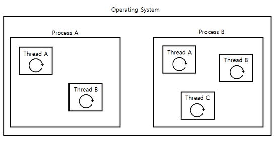
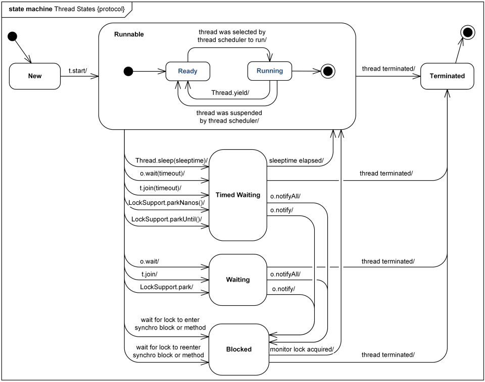

### 💭 25장 정리

- 쓰레드
- Runnable
- synchronized

---

#### ☑️ 쓰레드



- `경량 프로세스` 라고도 불림
- 보다 빠른 처리를 할 필요가 있을 때, 쓰레드를 사용하면 보다 빠른계산을 처리할 수 있다
- 쓰레드가 수행되는 우리가 구현하는 메소드는 `run()`메소드이다
- 쓰레드를 시작하는 메소드는 `start()`이다
- 쓰레드 클래스가 다른 클래스를 확장할 필요가 있는 경우에는 `Runnable 인터페이스`를 구현하면 되고, 그렇지 않은 경우에는 쓰레드 클래스를 상속하여 사용하면 됨
- `start()` 메소드를 호출하면, 쓰레드 클래스에 있는 `run()`메소드의 내용이 끝나든, 끝나지 않든 간에 쓰레드를 시작한 메소드에서는 그 다음줄에 있는 코드를 실행함  
```java
MyRunnable runnable = new MyRunnable();
new Thread(runnable).start();

MyThread thread = new MyThread();
thread.start();
```



#### ☑️ 데몬 쓰레드

- 해당 쓰레드가 종료되지 않아도 다른 실행중인 일반 쓰레드가 없다면 멈춰버림
- 부가적인 작업을 수행하는 쓰레드를 선언할 때 사용
  - ex) 모니터링 쓰레드

#### ☑️ Thread-safe

- 여러 쓰레드가 하나의 객체에 있는 인스턴스 변수를 동시에 처리할 때 발생할 수 있는 문제를 해결하기 위해 사용
  - StringBuffer : 쓰레드에 안전 => synchronized블록으로 주요데이터 처리부분을 감쌈 => 하나의 문자열 객체를 여러 쓰레드에서 공유하는 경우에 사용
  - StringBuilder : 쓰레드에 안전하지않음 => synchronized 사용안함 => 여러 쓰레드에서 공유할 일이 없을때 사용
- `synchronized` 사용하게 되면 메소드를 수행하고 있을때 다른 쓰레드에서 수행하려고 하면, 늦게 온 쓰레드는 기다림

```java
Object lock = new Object();
public void plus(int value){
    synchronized (lock){
        amount += value;
    }
}
public void minus(int value){
  synchronized (lock){
    amount -= value;
  }
}
```

---

### 💭 단답형

#### 1. 쓰레드와 프로세스의 차이를 이야기해보세요

- 프로세스는 운영체제로부터 자원을 할당받는 작업의 단위이고, 쓰레드는 프로세스가 할당받은 자원을 이용하는 실행의 단위
- 프로세스는 실행될 때 운영체제로부터 프로세서를 할당받고, 운영되기 위해 필요한 주소 공간, 메모리 등 자원을 할당받음
- 쓰레드는 프로세스 내에서 동작되는 여러 실행의 흐름으로 프로세스 내의 주소공간이나 자원들을 같은 프로세스 내에 스레드끼리 공유하면서 실행됨

#### 2. 여러분들이 쓰레드 클래스를 만들기 위해서는 어떤 인터페이스를 구현하면 될까요?

- Runnable

#### 3. 2에서 이야기한 인터페이스에 선언되어 있는 유일한 메소드는?

- run( )

#### 4. 쓰레드 클래스를 만들기 위해서는 어떤 클래스를 확장해야하나요?

- Thread클래스

#### ⚠️5. 쓰레드가 시작되는 메소드의 이름은?

- run( )

#### ⚠️6. 쓰레드를 시작하는 메소드의 이름은?

- start( )

#### 7. 쓰레드에 선언되어 있는 sleep( ) 메소드의 역할은?

- 특정시간동안 쓰레드가 정지
- 매개변수로 넘어온 시간만큼 대기

#### ⚠️8. sleep() 메소드를 사용할때 try-catch로 감싸주어 예외를 처리해야하는데 이유는?

- sleep() 메소드로 대기하고 있는 중에 interrupt가 될 수 있으므로, InterruptedException이 발생할 수 있다

#### 9. 데몬쓰레드와 일반쓰레드의 차이는?

- 데몬쓰레드는 만약 프로세스가 종료되는 상황이 되었을때 해당 쓰레드가 종료되지 않아도 다른 실행중인 일반 쓰레드가 없다면 해당 쓰레드는 중지됨

#### 10. synchronized 구문은 왜 써주며, 어디에 사용해야 하나요?

- 동시에 여러 쓰레드에서 하나의 값에 접근하려고 할때 데이터의 정합성을 지키기 위해서 사용
- 여러 쓰레드에서 접근할 일이 있을 경우에만 사용

#### 11. synchronized를 사용하는 두가지 방법은?

- 메소드 자체를 synchronized로 선언
- 메소드 내에 필요한 부분만 블록단위 사용

#### ⚠️12. 쓰레드의 상태에는 어떤것들이 있나요?

- NEW, RUNNABLE, BLOCKED, WAITING, TIMED_WAITING, TERMINATED

#### 13. 쓰레드에 선언되어 있는 join() 메소드의 용도는 무엇인가요?

- 수행중인 쓰레드가 종료될때까지 대기

#### 14. 쓰레드에 선언되어 있는 interrupt() 메소드의 용도는?

- 해당 쓰레드를 종료

#### ⚠️15. interrupt() 메소드를 호출하면 해당 쓰레드는 어떤 상태에 있을때 interrupt() 메소드가 호출된 효과가 발생하나요?

- sleep(), wait(), join() 메소드가 호출되어 대기중인 상태에서만 interrupt() 메소드가 처리됨

#### ⚠️16. object 클래스에 선언된 wait() 메소드의 용도는 무엇인가요?

- notify(), notifyAll() 메소드를 호출할 때까지 현재 쓰레드가 대기

#### 17. object 클래스에 선언된 notify() 메소드의 용도는 무엇인가요?

- 대기중인 쓰레드가 계속해서 작업하도록 쓰레드를 깨움

#### ⚠️18. ThreadGroup 클래스에 선언된 enumerate() 메소드의 용도는?

- 쓰레드 그룹에 포함된 쓰레드나 쓰레드 그룹의 목록을 매개변수로 넘어온 배열에 담음